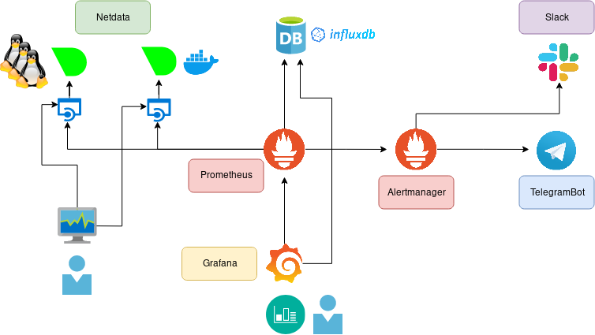
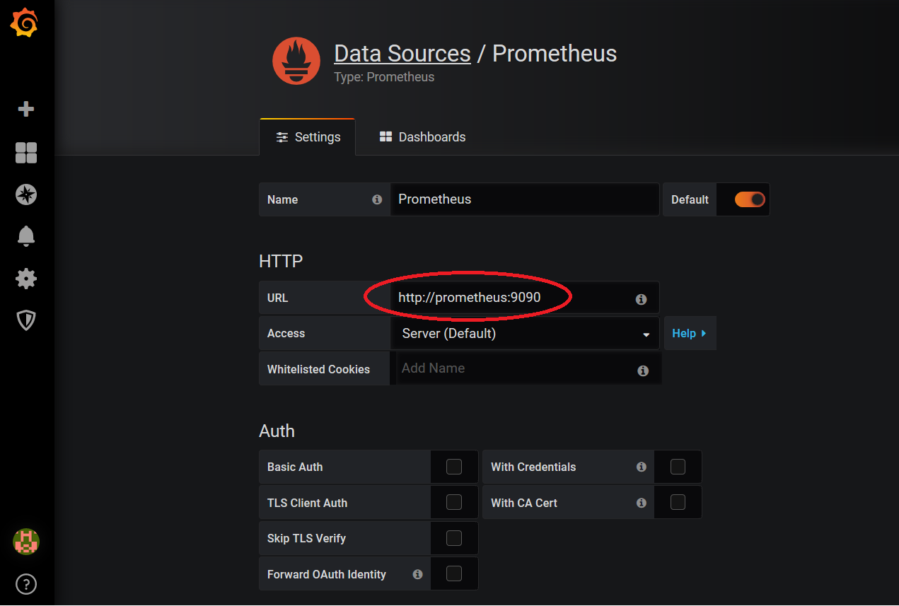
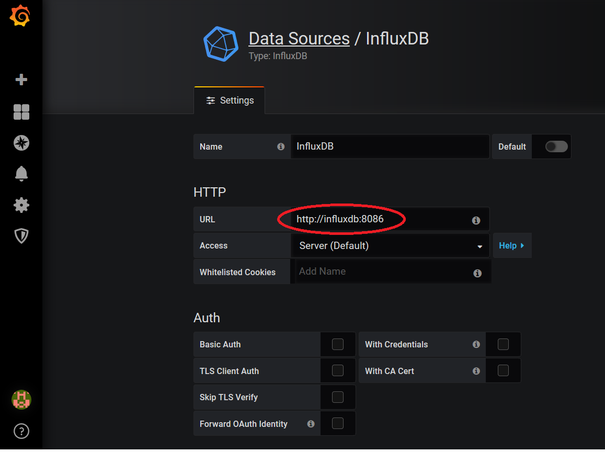
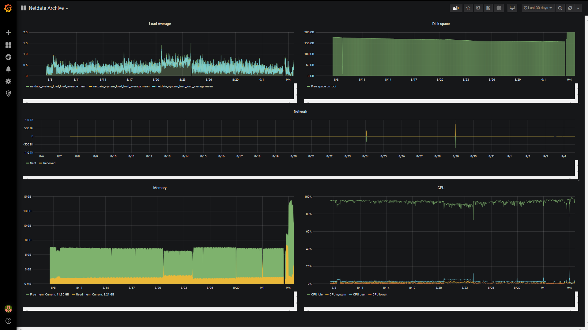
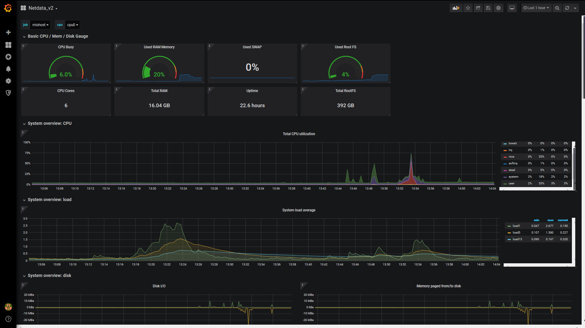
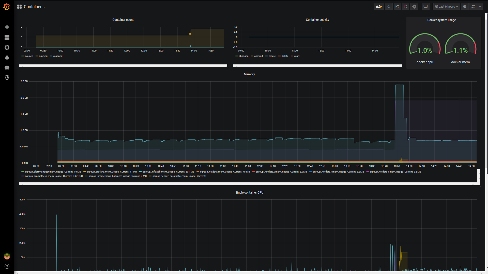

# download2019_monitoring_demo

In this repo you can find all you need to create an monitoring infrastructure to use for demo.

Product used:
- netdata
- prometheus
- alertmanager
- influxdb
- grafana
- prometheus_bot 
- docker



All is a docker container but you can add all hosts you want to monitoring.
You can also monitoring your docker server.

We use two different method to notify the alarm.
- Telegram --> via bot in a container
- Slack --> via webhook

## Build up

### Prereq
Before build you need to create a telegram bot and slack channel with related token and webhook.
If you want monitoring docker container please enable metrics and install netdata on docker host, if not you can proceed with build.

#### Telegram bot

Create a Telegram bot and put the token in Docker/prometheus_bot/config.yaml

```bash 
telegram_token: "< YOUR TELEGRAM BOT TOKEN >"
# ONLY IF YOU USING TEMPLATE required for test
#
# template_path: "template.tmpl"
# time_zone: "Europe/Rome"
# split_token: "|"
#
# # ONLY IF YOU USING DATA FORMATTING FUNCTION, NOTE for developer: important or test fail
# time_outdata: "02/01/2006 15:04:05"
# split_msg_byte: 4000
``` 

Please see https://core.telegram.org/bots

#### Skack 

Create a new slack channel and add a webhook url.

See https://get.slack.help/hc/en-us/articles/115005265063-Incoming-WebHooks-for-Slack


#### Enable docker metrics

Edit or create /etc/docker/daemon.json and put in
```json
{
  "metrics-addr" : "127.0.0.1:9323",
  "experimental" : true
}
``` 

Then restart docker server

```bash 
]# systemctl restart docker
``` 

See https://docs.docker.com/config/thirdparty/prometheus/

#### Install netdata on docker host

Login in your docker host and exec

```bash 
]# bash <(curl -Ss https://my-netdata.io/kickstart.sh)
``` 

Now stop netdata and change port to 19998 because 19999 is used by netdata container.

```bash 
]# systemctl stop netdata
]# vi /usr/lib/systemd/system/netdata.service 
.
.
ExecStart=/usr/sbin/netdata -P /var/run/netdata/netdata.pid -p 19998 -D -W set global 'process scheduling policy' 'keep' -W set global 'OOM score' 'keep'
.
.
]# systemctl daemon-reload 
]# systemctl start netdata
``` 

See https://docs.netdata.cloud/packaging/installer/

---

### Docker compose

You can build step by step or use a docker-compose.

With docker compose:

```bash 
]# docker-compose up -d

]# docker ps
CONTAINER ID        IMAGE                                        COMMAND                  CREATED             STATUS              PORTS                                            NAMES
476c33fe08d5        download2019monitoringdemo_influxdb         "/usr/bin/influxd -c…"   24 seconds ago      Up 20 seconds       0.0.0.0:8086->8086/tcp, 0.0.0.0:8088->8088/tcp   influxdb
e1e98b5ad11f        download2019monitoringdemo_prometheus       "/opt/prometheus/pro…"   24 seconds ago      Up 21 seconds       0.0.0.0:9090->9090/tcp                           prometheus
e93958e617bc        download2019monitoringdemo_grafana          "/root/grafana-serve…"   24 seconds ago      Up 21 seconds       0.0.0.0:3000->3000/tcp                           grafana
eb9dcf4e53a3        download2019monitoringdemo_alertmanager     "/opt/alertmanager/a…"   24 seconds ago      Up 21 seconds       0.0.0.0:9093->9093/tcp                           alertmanager
12dfbcc3b957        download2019monitoringdemo_prometheus_bot   "/bin/sh -c '/go/bin…"   24 seconds ago      Up 20 seconds       0.0.0.0:9087->9087/tcp                           prometheus_bot
e86358b7a222        download2019monitoringdemo_netdata          "/bin/sh -c 'sh entr…"   24 seconds ago      Up 21 seconds       0.0.0.0:19999->19999/tcp, 0.0.0.0:8080->80/tcp   netdata
```

If you don't like docker-compose :-D please read below. 


### Create network

	docker network create --driver bridge monitoring_net

### Build docker images

	cd Docker
	docker build -t netdata:latest netdata/.
	docker build -t prometheus:2.12 prometheus/.
	docker build -t alertmanager:0.17 alertmanager/.
	docker build -t influxdb:1.7.6 influxdb/.
	docker build -t prometheus_bot:0.0.1 prometheus_bot/.
	docker build -t grafana:6.2.5 grafana/.

### Run container

	docker run -d -it --name netdata --hostname netdata --network=monitoring_net -p 19999:19999 -p 8080:80 netdata:latest
	docker run -d -it --name prometheus --hostname prometheus --network=monitoring_net -p 9090:9090 prometheus:2.12
	docker run -d -it --name alertmanager --hostname alertmanager --network=monitoring_net -p 9093:9093 alertmanager:0.17
	docker run -d -it --name influxdb --hostname influxdb --network=monitoring_net -v /opt/influxdb:/var/lib/influxdb -p 8086:8086 -p 8088:8088 influxdb:1.7.6
	docker run -d -it --name grafana --hostname grafana --network=monitoring_net -p 3000:3000 grafana:6.2.5
	docker run -d -it --name prometheus_bot --hostname prometheus_bot --network=monitoring_net -p 9087:9087  prometheus_bot:0.0.1


Add firewall rules

```bash
]# firewall-cmd --add-port=19998/tcp
]# firewall-cmd --add-port=19999/tcp
]# firewall-cmd --add-port=9090/tcp
]# firewall-cmd --add-port=9093/tcp
]# firewall-cmd --add-port=3000/tcp
]# firewall-cmd --add-port=8080/tcp

]# firewall-cmd --list-all
public (active)
  target: default
  icmp-block-inversion: no
  interfaces: tun0 eth0
  sources:
  services: ssh dhcpv6-client http https
  ports: 19998/tcp 19999/tcp 3000/tcp 9090/tcp 9093/tcp 8080/tcp
  protocols:
  masquerade: yes
  forward-ports:
  source-ports:
  icmp-blocks:
  rich rules:
```

---

## Test services

Verify if all containter are up.

```bash
]# docker ps
CONTAINER ID        IMAGE                  COMMAND                  CREATED             STATUS              PORTS                                            NAMES
cb4c5ef5d818        prometheus:2.12        "/opt/prometheus/pro…"   16 hours ago        Up 16 hours         0.0.0.0:9090->9090/tcp                           prometheus
7c74637e2c09        alertmanager:0.17      "/opt/alertmanager/a…"   16 hours ago        Up 16 hours         0.0.0.0:9093->9093/tcp                           alertmanager
d9a376bbf77e        prometheus_bot:0.0.1   "/bin/sh -c '/go/bin…"   20 hours ago        Up 20 hours         0.0.0.0:9087->9087/tcp                           prometheus_bot
b407175eb760        grafana:6.2.5          "/root/grafana-serve…"   20 hours ago        Up 20 hours         0.0.0.0:3000->3000/tcp                           grafana
4cde8f87be38        influxdb:1.7.6         "/usr/bin/influxd -c…"   20 hours ago        Up 20 hours         0.0.0.0:8086->8086/tcp, 0.0.0.0:8088->8088/tcp   influxdb
388698f1ee93        netdata:latest         "/bin/sh -c 'sh entr…"   20 hours ago        Up 20 hours         0.0.0.0:19999->19999/tcp, 0.0.0.0:8080->80/tcp   netdata
```

Now check your service.

- grafana http://localhost:3000
- prometheus http://localhost:9090
- alertmanager http://localhost:9093
- netdata containter http://localhost:19999
- netdata docker host http://localhost:19998

---

## Configure monitoring

### Prometheus

#### Confing
Enter in prometheus container.

```bash
]# docker exec -it prometheus '/bin/bash'
[root@prometheus prometheus]#
```

Edit prometheus.yml and add new target.

```yaml
  - job_name: 'netdata'

    metrics_path: /api/v1/allmetrics
    params:
      format: [ prometheus ]

    static_configs:
      - targets: ['netdata:19999']

  - job_name: 'docker_host'

    metrics_path: /api/v1/allmetrics
    params:
      format: [ prometheus ]

    static_configs:
      - targets: ['< YOUR DOCKER HOST IP >:19998']
```

You can also use automatic target adding using file-based discovery without reload prometheus, like this.

```yaml
  - job_name: 'netdata_hosts'
    scrape_interval: 1s
    metrics_path: /api/v1/allmetrics
    params:
      format: [ prometheus ]
    file_sd_configs:
      - files:
        - target.json
        refresh_interval: 1m
```
See target.json file in appendix. 

Add alertmanager and alert rule.

```yaml
alerting:
  alertmanagers:
  - static_configs:
    - targets:
       - alertmanager:9093
```

```yaml
rule_files:
   - "alert.rules.yml"
```

Add remote write to influxdb

```yaml
remote_write:
  - url: "http://influxdb:8086/api/v1/prom/write?db=prometheus"
```

Now create a "alert.rules.yml" and put in the rule for alertmanager, see appendix.


#### Reload prometheus conf
	curl -X POST http://localhost:9090/-/reload

---

### Alertmanager

#### Config

Enter in alertmanager container.

```bash
]# docker exec -it alertmanager '/bin/bash'
[root@alertmanager alertmanager]#
```

Add new webhook for telegram bot and slack

```yaml
receivers:
- name: "slack"
  slack_configs:
  - api_url: '< YOUR SLACK WEBHOOK >'
    send_resolved: true
    channel: '< YOUR CHANNEL NAME >'
    text: "{{ range .Alerts }}<!channel> {{ .Annotations.summary }}\n{{ .Annotations.description }}\n{{ end }}"
- name: 'telegram'
  webhook_configs:
  - send_resolved: True
    url: http://prometheus_bot:9087/alert/< CHAT ID >
```

Set default receiver to telegram and routes:

- slack --> for alarm with severity critical and warning
- telegram --> only for alarm with severity critical

```yaml
  receiver: 'telegram'
  routes:
    - receiver: "slack"
      group_wait: 10s
      match_re:
        severity: critical|warning
      continue: true
    - receiver: "telegram"
      group_wait: 10s
      match_re:
        severity: critical
      continue: true
```

#### Reload alertmanager conf
	curl -X POST http://localhost:9093/-/reload

---

### Influx

#### Create database influx
        curl -i -X POST http://localhost:8086/query --data-urlencode "q=CREATE DATABASE prometheus"

#### Verify database influx
        curl -i -X POST http://localhost:8086/query --data-urlencode  "q=SHOW DATABASES"

---

## Grafana

Create prometheus datasource



Create influxdb datasource 


Create your dashboard 




---

### Ansible

In ansible_playbooks directory you can find a simple playbook and roles to configure prometheus, alertmanager and grafana

#### Var file

	ansible_playbooks/inventories/group_vars/all/all_vars.yml

```yaml
prometheus_container_name: prometheus
alertmanager_container_name: alertmanager

conf_file_prefix: "< YOUR CONF FILE LOCATION >"
alertmanager_file_path: "{{ conf_file_prefix }}/alertmanager.yml"

prometheus_file_path: "{{ conf_file_prefix }}/prometheus.yml"
target_file_path: "{{ conf_file_prefix }}/target.json"
alert_rules_file_path: "{{ conf_file_prefix }}/alert.rules.yml"

prometheus_name: "Prometheus"
grafana_url: "http://localhost:3000"
org_id: "1"
grafana_api_key: "< YOUR GRAFANA API KEY >"
prometheus_url: "http://prometheus:9090"

influx_name: "InfluxDB"
influx_url: "http://influxdb:8086"
influx_dbname: "prometheus"
```

#### Usage

	ansible-playbook conf_monitoring_lab.yml -t <TAG>

Tags are:
- prometheus --> to configure prometheus
- alertmanager --> to configure alertmanager
- grafana --> to configure grafana

--- 

### Tips & tricks

#### Test web site
	for i in `seq 1 10000`; do curl http://localhost:8080 ; done

#### Add more host to monitoring

	 docker run -d -it --name netdataX --hostname netdataX --network=monitoring_net  netdata_only:latest

Add your new target in target.json file. 

#### Clean all messages in the slack channel
Start a container

	docker pull kfei/slack-cleaner
	docker run -it kfei/slack-cleaner

Run cleaner in a container

	slack-cleaner --token=< YOUR TOKEN > --message --channel download2019_monlab --bot --perform --rate 1

---

## Appendix

### Alert rule
```yaml
groups:
  - name: alerting_rules
    rules:
      - alert: LoadAverage1m
        expr: netdata_system_load_load_average{dimension="load1"} >= 3.75
        labels:
          severity: warning
        annotations:
          summary: "Instance {{ $labels.instance }} - high load average"
          description: "{{ $labels.instance  }} (measured by {{ $labels.job }}) has high load average ({{ $value }}) over 1 minute."

      - alert: Instance Down
        expr: up == 0
        for: 1m
        labels:
          severity: critical
        annotations:
          summary: "Endpoint {{ $labels.instance }} down"
          description: "{{ $labels.instance }} of job {{ $labels.job }} has been down for more than 1 minutes."

      - alert: Container Down
        expr: netdata_docker_engine_engine_daemon_container_states_containers_count_average{dimension="stopped"} > 0
        for: 20s
        labels:
          severity: critical
        annotations:
          summary: "Container {{ $labels.instance }} down"
          description: "{{ $labels.instance }} of job {{ $labels.job }} has been down for more than 20 seconds."

      - alert: Disk Free on root partition
        expr: 100 / sum(netdata_disk_space_GiB_average{family="/"}) by (job) * sum(netdata_disk_space_GiB_average{family="/",dimension=~"avail|cached"}) by (job) < 10
        for: 1m
        labels:
          severity: critical
        annotations:
          summary: "Endpoint {{ $labels.job }} low disk free"
          description: "The {{ $labels.job }} has low disk free {{ $value }} over 1 minute."

      - alert: Memory usage more_31
        expr: 100 / sum(netdata_system_ram_MiB_average) by (job) * sum(netdata_system_ram_MiB_average{dimension=~"free|cached"}) by (job) < 70
        for: 1m
        labels:
          severity: critical
        annotations:
          summary: "Memory alert for node {{ $labels.job }}"
          description: "{{ $labels.job }} memory usage is {{ humanize $value}}%."

      - alert: Apache requests
        expr: netdata_apache_requests_requests_persec_average > 70
        for: 10s
        labels:
          severity: warning
        annotations:
          summary: "Apache request alart for node {{ $labels.job }}"
          description: "{{ $labels.job }} has many http request {{ humanize $value}}%."

      - alert: Apache requests block
        expr: netdata_apache_requests_requests_persec_average > 150
        for: 30s
        labels:
          severity: critical
        annotations:
          summary: "Apache request alart for node {{ $labels.job }}"
          description: "{{ $labels.job }} has many http request {{ humanize $value}}%."
```

### Prometheus conf
```yaml
# my global config
global:
  scrape_interval:     15s # Set the scrape interval to every 15 seconds. Default is every 1 minute.
  evaluation_interval: 15s # Evaluate rules every 15 seconds. The default is every 1 minute.
  # scrape_timeout is set to the global default (10s).

# Alertmanager configuration
alerting:
  alertmanagers:
  - static_configs:
    - targets:
       - alertmanager:9093

# Load rules once and periodically evaluate them according to the global 'evaluation_interval'.
rule_files:
   - "alert.rules.yml"
  # - "first_rules.yml"
  # - "second_rules.yml"

# A scrape configuration containing exactly one endpoint to scrape:
# Here it's Prometheus itself.
scrape_configs:
  # The job name is added as a label `job=<job_name>` to any timeseries scraped from this config.
  - job_name: 'prometheus'

    # metrics_path defaults to '/metrics'
    # scheme defaults to 'http'.

    static_configs:
    - targets: ['localhost:9090']
  - job_name: 'netdata'

    metrics_path: /api/v1/allmetrics
    params:
      format: [ prometheus ]

    static_configs:
      - targets: ['netdata:19999']
  - job_name: 'docker_host'

    metrics_path: /api/v1/allmetrics
    params:
      format: [ prometheus ]

    static_configs:
      - targets: ['< YOUR DOCKER HOST IP >:19998']
  - job_name: 'netdata_hosts'
    scrape_interval: 1s
    metrics_path: /api/v1/allmetrics
    params:
      format: [ prometheus ]
    file_sd_configs:
      - files:
        - target.json
        refresh_interval: 1m

remote_write:
  - url: "http://influxdb:8086/api/v1/prom/write?db=prometheus"
```

### target.json
```json
[
  {
    "targets": [ "netdata2:19999", "netdata3:19999", "netdata4:19999" ],
    "labels": {
      "env": "prod",
      "job": "netdata_hosts"
    }
  }
]
```

### Alertmanager
```yaml
global:
  resolve_timeout: 5m

route:
  group_by: ['alertname']
  group_wait: 10s
  group_interval: 10s
  repeat_interval: 1h
  receiver: 'telegram'
  routes:
    - receiver: "slack"
      group_wait: 10s
      match_re:
        severity: critical|warning
      continue: true
    - receiver: "telegram"
      group_wait: 10s
      match_re:
        severity: critical
      continue: true
receivers:
- name: "slack"
  slack_configs:
  - api_url: '< YOUR SLACK WEBHOOK >'
    send_resolved: true
    channel: '< YOUR SLACK CHANNEL >'
    text: "{{ range .Alerts }}<!channel> {{ .Annotations.summary }}\n{{ .Annotations.description }}\n{{ end }}"
- name: 'telegram'
  webhook_configs:
  - send_resolved: True
    url: http://prometheus_bot:9087/alert/< CHAT ID >
inhibit_rules:
  - source_match:
      severity: 'critical'
    target_match:
      severity: 'warning'
    equal: ['alertname', 'dev', 'instance']
```
